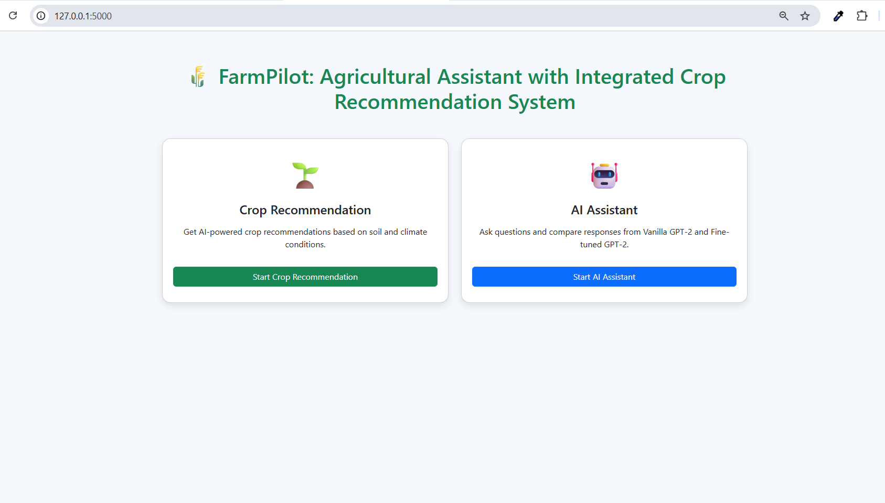

# AgriGPT: Fine-Tuned GPT-2 Agricultural Assistant with Integrated Crop Recommendation System

**AgriGPT** is a dual-function digital platform designed to support farmers with **agricultural knowledge** and **data-driven crop recommendations**. It integrates a **GPT-2 AI assistant** for answering queries and a **Machine Learning crop recommendation system** that predicts suitable crops based on soil and environmental parameters.

### Live Link: https://agrigpt.luminatechbd.site/

Note: Updated the UI and deployed in server for better user experience (React + Django + MySQL).

---

## Features

- **AI Agricultural Assistant**
  - Fine-tuned GPT-2 model for agricultural Q&A.
  - Provides accurate, context-aware responses to farmer queries.
  - Side-by-side comparison with vanilla GPT-2.

- **Crop Recommendation System**
  - Predicts suitable crops using Random Forest, SVM, and Logistic Regression.
  - Inputs: Nitrogen (N), Phosphorus (P), Potassium (K), pH, rainfall, temperature, humidity.
  - Random Forest achieved **99.32% accuracy**.

- **Web Application**
  - Built with **Flask**.
  - Intuitive interface with navigation between AI Assistant and Crop Recommendation.
  - Simple forms and clear output displays for farmers.

---

## Notebook Analysis Visualizations

**Agricultural QA Dataset**


*WordCloud of most frequent words in questions*


*WordCloud of most frequent words in answers*


*Histogram showing question length distribution*


*Histogram showing Answer length distribution*

**Crop Recommendation Dataset**

.png)
*Histograms and KDE of soil and environmental features*


*Bar chart showing balanced crop categories*


*Confusion matrix for Random Forest crop prediction*

---

## Demo


*AgriGPT Homepage*


*AI Assistant generating responses*


*Crop Recommendation page predicting suitable crops*

---

## Installation

1.  **Clone the repository:**
    ```bash
    git clone [https://github.com/mdjisan1/AgriGPT-Enhancing-Agriculture-with-Fine-Tuned-Language-Models-and-Crop-Prediction.git](https://github.com/mdjisan1/AgriGPT-Enhancing-Agriculture-with-Fine-Tuned-Language-Models-and-Crop-Prediction.git)
    ```

2.  **Navigate to the project directory:**
    ```bash
    cd AgriGPT
    ```

3.  **Install dependencies:**
    ```bash
    pip install -r requirements.txt
    ```

4.  **Run the Flask application:**
    ```bash
    python app.py
    ```

5.  Open your browser at `http://127.0.0.1:5000`.

---

## Datasets

-   **Agricultural Q&A Dataset:** [KisanVaani (Hugging Face)](https://huggingface.co/datasets/kisanvaani/kisan-vaani-QA), 18,403 preprocessed Q&A pairs.
-   **Crop Recommendation Dataset:** [Kaggle Crop Recommendation Dataset](https://www.kaggle.com/datasets/atharvaingle/crop-recommendation-dataset), 2200 samples, 22 crops.

---

## Model Details

-   **AI Assistant:** GPT-2 fine-tuned using Hugging Face Transformers and PyTorch.
-   **Crop Recommendation:** Random Forest selected as best performer; SVM and Logistic Regression also trained for comparison.

---

## Future Work

-   Multilingual GPT models for regional languages (Bangla, Hindi).
-   Integration with IoT sensors for real-time soil and weather data.
-   Mobile application support for offline usage.
-   Federated learning for privacy-preserving Q&A.

---

## Author

**Isha Das**  
📧 [isha@idtechsolutionsbd.com]  

**Md Jisan Ahmed**  
📧 [jisan3325@gmail.com]  


